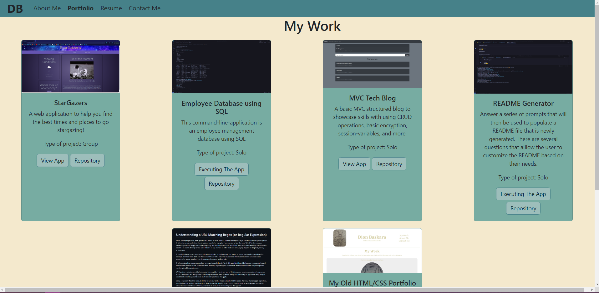

# Dion Baskara - Portfolio

  A shiny new portfolio, now built using React!  
  

  ## Description

  This will serve as my new updated portfolio showcasing skills and technologies I've learned since creating my old basic HTML/CSS portfolio.

  Screenshot of final output:  
  
  ## Table of Contents
  * [Dependencies](#dependencies)
  * [Installation](#installation)
  * [Executing Program](#execution)
  * [Authors](#authors)
  * [Questions](#questions)
  * [License](#license)
  * [Acknowledgements](#acknowledgements)
  * [Tests](#tests)

  Link to the repository:  
  https://github.com/dionkb/DionKBaskara-REACT-Portfolio.git

  ## Getting Started

  ### Dependencies
  See package.json file

  ### Installation
  N/A

  ## Usage

  ### Executing Program
  N/A
  
  Link to the deployed application:  
  https://dionkb.github.io/DionKBaskara-REACT-Portfolio

  ## Additional Information

  ### Authors
  Dion Baskara

  ### Questions
  For any questions, please reach out to me at dionkbaskara@gmail.com

  ### Contributing
  To help contribute to the project, reach out to me on Github.  
  There, you can report an issue if you encounter one.  
  GitHub profile: <a href="https://github.com/dionkb">Click Here</a>

  ### License  
  MIT License: For more information,  <a href="https://opensource.org/license/mit/">click here</a>  
  See also: LICENSE.md file located within directory 

  ### Acknowledgements
  N/A

  ### Tests
  N/A
  